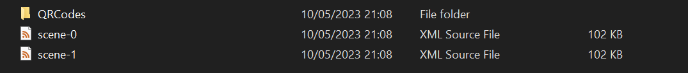
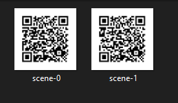

# Festo-xml-json-adapter  documentation
> Part of a transitional project leading into an engineering thesis at the end of bachelor's degree in automatics and robotics engineering study

## **Overview**

Festo-xml-json-adapter (JXAR) acts as an adapter which translates json files into xml station files accepted by [Festo Didactic AR](https://play.google.com/store/apps/details?id=com.festo.didactic.ar&hl=pl&gl=US&pli=1)

Json files contain data about objects generated by [Unity app](https://github.com/przWaw/ProjektPrzejsciowyUnity) created specifically for managing and manipulating objects in a 3D scene. Those objects are meant to be displayed in the above-mentioned Festo app. To do so certain steps are required.

## **Usage**

Standalone app is packaged into .jar file, its main method can be invoked from a console, passing the required arguments:


Input arguments
| Parameter      | Type   | Required?   | Description |
|----------------|------- |-------------|-------------|
| `saveLocation` | string | yes         | absolute path to a directory in which generated files should be saved |
| `file`         | string | atleast one | absolute path to json file(s) containing object details, which should be translated to xml station file |

Output arguments
| Parameter      | Type      | Description |
|----------------|-----------|-------------|
| `xmlFiles`     | xml files | station files recognizable by Festo Station, each name of the files the same as the original json files|
| `qrCodes`      | png files | qr codes created in a subdirectory /QRCodes, name of the file the same as the original json file |

_note_:
> arguments should be passed like this: `jxar-adapter.jar` `saveLocation` `file-1` `file-2` and so on, each argument separated by single space, **order of arguments matters**

### **Usage example**

Invocation:
``` sh
java -jar jxar-adapter.jar C:\Users\User\Downloads\ar-stations C:\Users\User\Downloads\scene-0.json C:\Users\User\Downloads\scene-1.json
```
creates 2 files and _QRCodes_ subfolder in **_ar-stations_** directory:


and 2 QR codes in subdirectory:




**QR Codes**

QR codes are created to import user-created objects in the 3D scene faster. Each QR code contains an address to a local machine that starts like this: `http://mes-pc.festo.systems/factory/apps/ar/scenes/MPS400/` + `title of the file`


**Created files**

Each created xml file is based on `Joining_01.xml` file from original local server Festo Didactic Station. It serves as a template for every custom-created scene exported from Unity App as json file. This template file acts as an initializer, containing required start-up info needed by the Festo Didactic AR App. This adapter simply deletes all original data about input objects and inserts objects created by a user. 